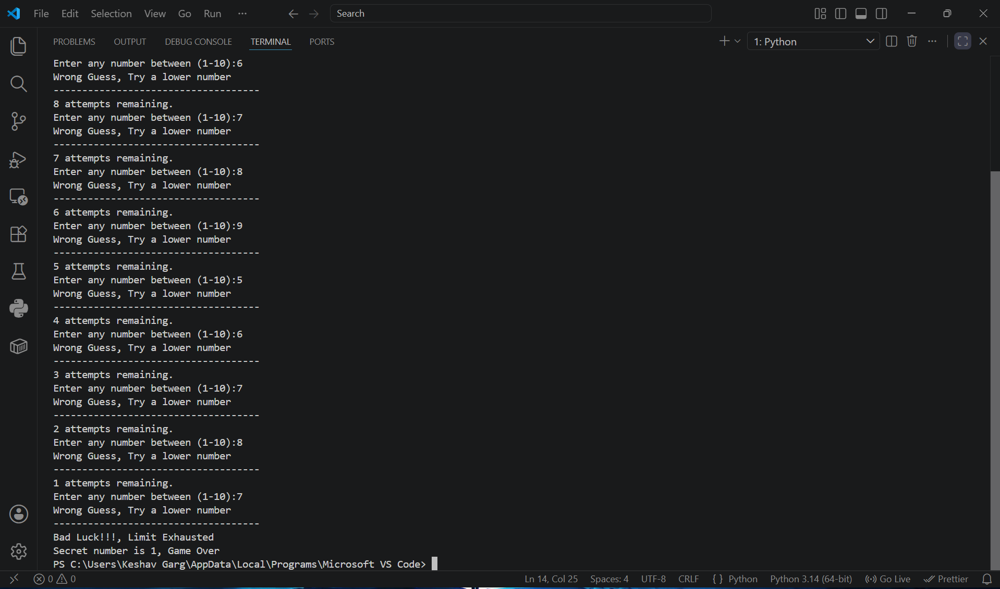

# Number Guessing Game 🎮

A simple, interactive console-based game written in Python where the player attempts to guess a randomly generated secret number between 1 and 10.

### 📸 Game Screenshot


## 📝 Description
This project is a classic "Number Guessing Game". The script randomly selects a secret number from 1 to 10. The player is given **10 attempts** to guess the correct number. After each wrong guess, the game provides a hint—telling the user whether they need to guess *higher* or *lower*. 

## ✨ Features and Logic
Here is a breakdown of the core programming concepts used in this game:

* **Random Module:** Uses `random.randint(1, 10)` to generate the secret number dynamically.
* **State Management:** 
  * Tracks the number of `attempts` remaining.
  * Uses a boolean flag `is_guess_correct` to evaluate if the user won or if they exhausted all their attempts.
* **Looping:** Utilizes a `while` loop (`while num <= 10:`) to keep the game running until the user guesses correctly or runs out of attempts.
* **Conditional Logic:** Uses `if`, `elif`, and `else` statements to:
  * Check if the guess matches the secret number.
  * Provide dynamic feedback to try a "lower" or "higher" number.
* **String Formatting:** Uses f-strings (e.g., `f"{attempt} attempts remaining"`) to cleanly display changing variables to the player.

## 🚀 How to Run the Game
1. Ensure you have [Python](https://www.python.org/) installed on your system.
2. Save the code in a file named `number_guessing_game.py`.
3. Open your terminal or command prompt.
4. Navigate to the folder where the file is saved.
5. Run the following command:
   ```bash
   python number_guessing_game.py
